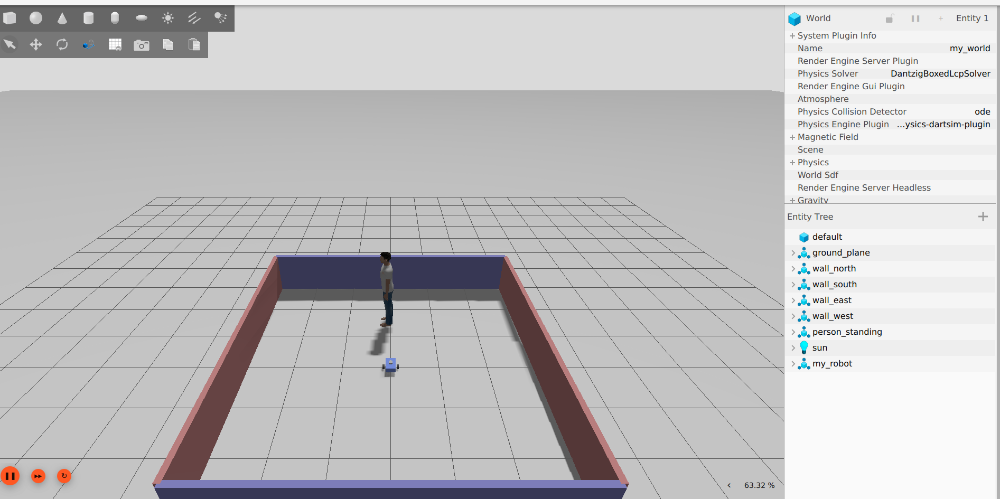
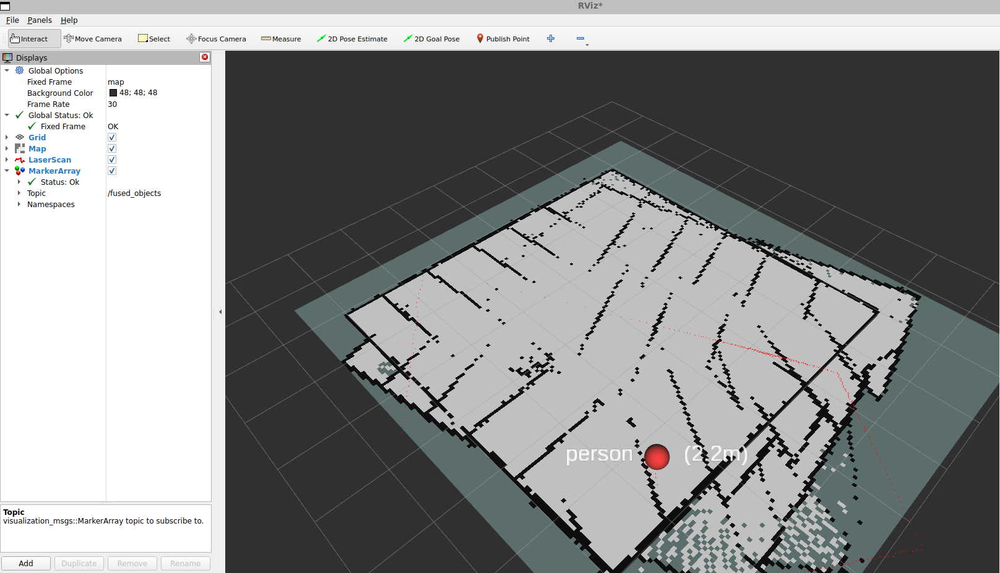
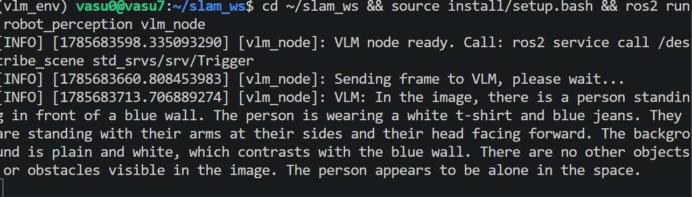

# ros2-diffdrive-slam

A differential-drive robot I built from scratch in ROS 2 to learn a full mobile-robot perception and state-estimation stack. It maps a room with 2D LiDAR SLAM, fuses wheel odometry with an IMU for a steadier pose, detects objects with YOLOv8, drops detected objects onto the map by combining the camera with the LiDAR, and describes what it sees in plain language with a vision-language model. Everything runs live in simulation.

Built on ROS 2 Jazzy and Gazebo Harmonic, developed on Ubuntu 24.04 under WSL2 with an RTX 2070.

## Why I built it

I wanted to actually understand how a robot perception stack fits together rather than run someone else's launch file. So I started with an empty package and added one piece at a time: the robot body, the wheels, a LiDAR, the drive controller, mapping, then a camera, object detection, sensor fusion, and finally a language model for scene description. Each layer had to work before I moved on, which meant I ended up debugging the whole pipeline myself, from TF frames and controllers to the sensor bridge, the EKF, and GPU memory budgeting for the vision models.

## What it does

- A custom differential-drive robot described in URDF and driven with ros2_control
- 2D LiDAR SLAM (slam_toolbox) that builds and saves an occupancy-grid map
- Wheel-odometry and IMU fusion through an EKF (robot_localization) for a steadier pose estimate
- YOLOv8n object detection on the camera, running on the GPU
- Camera-LiDAR fusion that places detected objects on the map with a distance label
- A LLaVA vision-language model, served over FastAPI, that describes the camera view on request

## Results

The robot mapping a walled room while its camera detects a person. The occupancy grid is built from LiDAR; the overlaid pose graph shows the trajectory and loop closures slam_toolbox uses to keep the map consistent.


The simulation environment: the robot, a person, and a cone obstacle inside a walled room.



The occupancy-grid map of the room.


Camera-LiDAR fusion. When YOLO detects a person, the node estimates the bearing from the bounding box, reads the LiDAR range at that bearing, and places a labelled marker on the map at the object's position. Here the marker reads "person (2.2m)".



Example VLM output. Calling the ROS service `describe_scene` sends the current camera frame to LLaVA and publishes the answer on `/scene_description`:

> In the image, there is a person standing in front of a blue wall. The person is wearing a white t-shirt and blue jeans. They are standing with their arms at their sides and their head facing forward. There are no other objects or obstacles visible in the image.



## How it fits together

Gazebo simulates physics, the LiDAR, the camera, and the IMU. robot_state_publisher publishes the TF tree from the URDF. ros2_control runs a diff_drive_controller that turns velocity commands into wheel speeds and publishes wheel odometry. An EKF from robot_localization fuses that wheel odometry with the IMU and publishes the odom to base_footprint transform, so the pose is more robust than wheels alone. slam_toolbox consumes the laser scans and the TF tree to build the map and publish the map to odom transform. In parallel, a YOLO node detects objects on the camera, a fusion node places detections on the map using the LiDAR, and a VLM node forwards camera frames to a LLaVA server on request.

## The robot

A differential-drive base built with xacro macros:

- base_footprint: ground-projected root frame
- base_link: chassis
- left_wheel, right_wheel: continuous joints, actuated by ros2_control
- caster: passive sphere for balance
- lidar_link: 360 degree laser mount
- camera_link: forward-facing RGB camera
- imu_link: IMU mount

The LiDAR is a 360-sample gpu_lidar at 10 Hz, 10 m range. The camera is 640x480 RGB. The IMU runs at 50 Hz.

## Perception and state estimation, layer by layer

- EKF (robot_localization): fuses wheel odometry and the IMU into the odom to base_footprint transform. Runs continuously.
- LiDAR SLAM (slam_toolbox): builds the map and localizes, using the EKF pose. Runs continuously.
- YOLOv8n: fast object detection, real-time bounding boxes for the 80 COCO classes.
- Camera-LiDAR fusion: turns a 2D detection into a map position by matching the camera bearing to the LiDAR ray, then publishes a labelled marker.
- LLaVA-1.6-Mistral-7B: rich scene description in natural language, on demand through a ROS service (a few seconds per frame).

A note on hardware. On an 8 GB GPU, YOLO, LLaVA, and Gazebo cannot all run at full tilt at once. I profiled the VRAM and run detection/fusion and the VLM as two separate modes rather than concurrently. Knowing when that trade-off is needed matters more than pretending the hardware is unlimited.

## Running it

1. Simulation, robot, control, and EKF. The plugin-path export is required so Gazebo finds the ros2_control system plugin:

```bash
export GZ_SIM_SYSTEM_PLUGIN_PATH=/opt/ros/jazzy/lib
ros2 launch my_robot gazebo_ekf.launch.py
```

2. SLAM:

```bash
ros2 launch slam_toolbox online_async_launch.py use_sim_time:=true
```

3. Drive it. Jazzy's diff_drive_controller expects TwistStamped:

```bash
ros2 run teleop_twist_keyboard teleop_twist_keyboard --ros-args -p stamped:=true -r cmd_vel:=/diff_drive_controller/cmd_vel
```

4. Object detection, or camera-LiDAR fusion (fusion publishes map markers on /fused_objects):

```bash
ros2 run robot_perception yolo_node
ros2 run robot_perception fusion_node --ros-args -p use_sim_time:=true
```

5. VLM scene understanding. Start the LLaVA server in its own environment, then the ROS node, then call the service:

```bash
cd ~/vlm_server && VLM_MODEL=llava uvicorn vlm_server:app --host 0.0.0.0 --port 8000
ros2 run robot_perception vlm_node
ros2 service call /describe_scene std_srvs/srv/Trigger
```

6. Save the map:

```bash
ros2 run nav2_map_server map_saver_cli -f ~/slam_ws/room_map --ros-args -p use_sim_time:=true -p save_map_timeout:=10000.0
```

## Things that bit me (and how I fixed them)

These cost me real time, so I am writing them down:

- teleop did nothing at first. In Jazzy, diff_drive_controller subscribes to a TwistStamped, not a plain Twist, so the robot just sat there. Fix: run teleop with -p stamped:=true.
- The controllers never loaded because Gazebo could not find the gz_ros2_control system plugin. Fix: export GZ_SIM_SYSTEM_PLUGIN_PATH=/opt/ros/jazzy/lib before launching.
- The world silently would not load through the launch include; Gazebo started an empty default world. Running gz sim with the world file as a direct argument fixed it.
- slam_toolbox produced no map when run as a bare node. Its own online_async launch activates it as a lifecycle node, which is what actually starts mapping.
- The map came out smeared with lines crossing the walls. The cause was the EKF over-trusting a noisy simulated IMU yaw, which made the heading jump about 30 degrees while the robot was standing still. Fixing the EKF to fuse IMU yaw rate only, and take heading from wheel odometry, gave a stable pose and a clean map.
- The fusion node never placed a marker at first. It was reading a single LiDAR ray at the detection bearing, which was often infinite. Searching a small window of rays and taking the median range fixed it.
- The fusion markers published but did not render in RViz. They were stamped with wall-clock time while everything else ran on sim time, so RViz discarded them. Running the node with use_sim_time:=true fixed it.
- A NumPy 2.x clash broke YOLO. Pinning numpy below 2.0 fixed it.
- Running YOLO and LLaVA together maxed the 8 GB GPU and the VLM timed out. Running them as separate modes solved it.

## What I would do next

- Fuse detections into the map as a persistent semantic layer rather than transient markers.
- Try a lighter VLM (Phi-3.5-Vision or similar) so detection and scene description can run at the same time within the GPU budget.
- Layer Nav2 on the saved map for autonomous navigation.
- Mask detected people before SLAM feature matching so moving people do not corrupt the map, which matters for robots working around humans.

## Stack

ROS 2 Jazzy, Gazebo Harmonic, ros2_control, slam_toolbox, robot_localization (EKF), YOLOv8n (Ultralytics), LLaVA-1.6-Mistral-7B, FastAPI, xacro/URDF, Python launch files, WSL2 (Ubuntu 24.04, RTX 2070)
